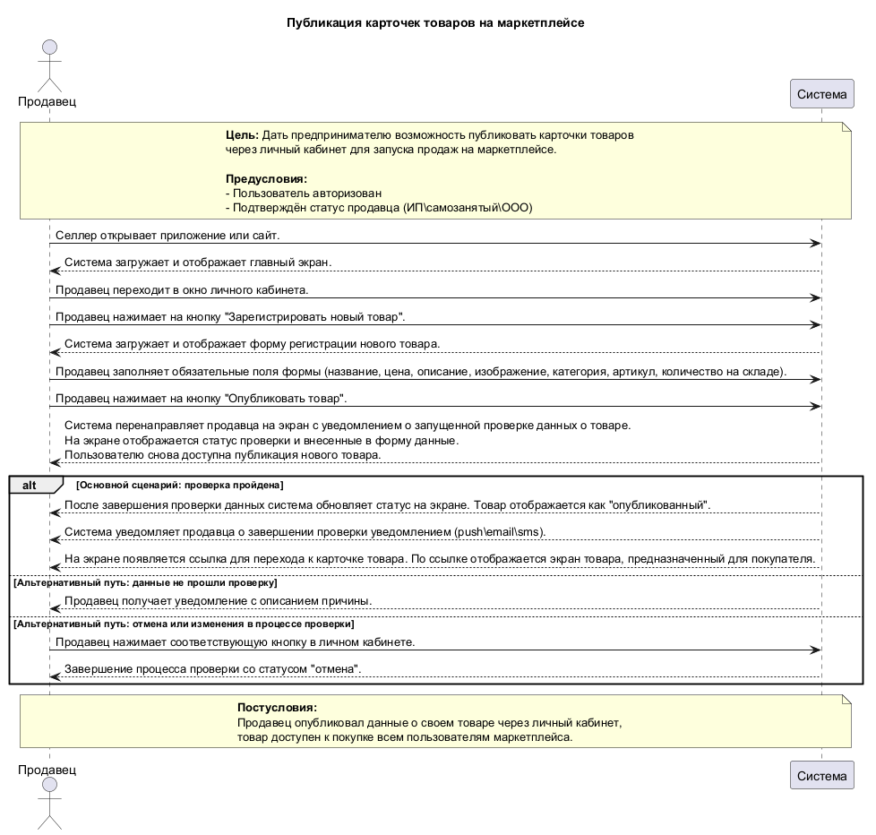
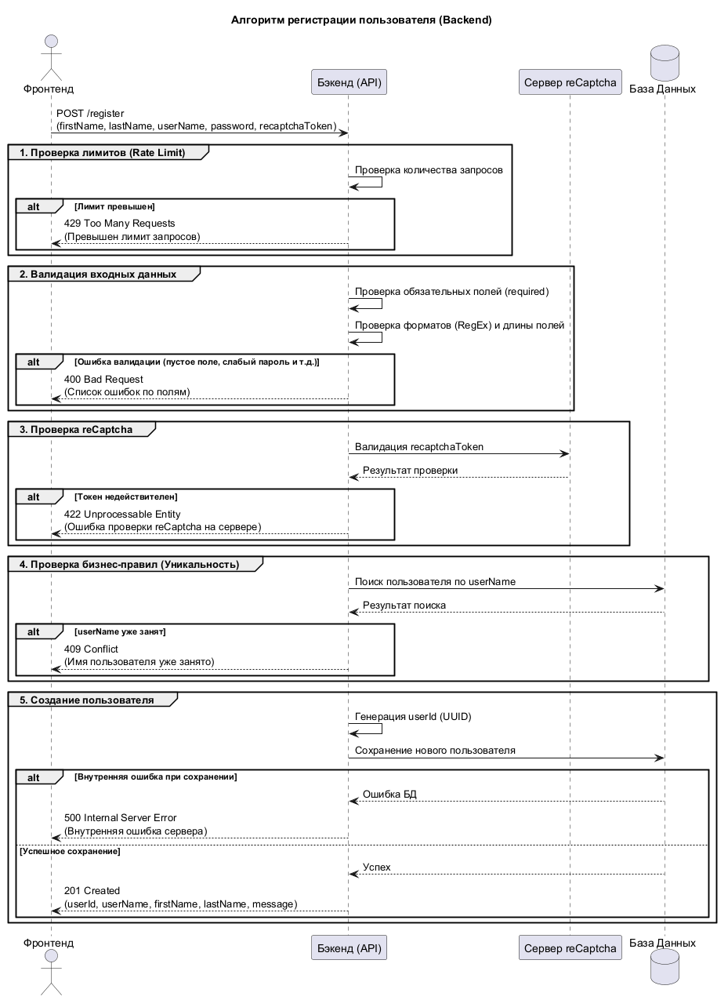

# Тестовое задание для Effective Mobile

[](docs/bpmn/task1-process-diagram.bpmn)
[](docs/uml/)
[](docs/api/task-3-rest-openapi.yaml)

---

## 📊 Артефакты

### 1. BPMN Диаграмма процесса
- 📄 [Скачать .bpmn](docs/bpmn/task1-process-diagram.bpmn)
- 🔧 [Открыть в bpmn.io](https://bpmn.io/tool/bpmn-js/)

### 2. UML Диаграммы

#### Диаграмма классов (Marketplace Seller)

- 📝 [Исходник .puml](docs/uml/task2-marketplace-seller-diagram.puml)

#### Диаграмма последовательности (Book Shop Registration)

- 📝 [Исходник .puml](docs/uml/task3-book-shop-registration-flow-diagram.puml)

### 3. Требования
- 📋 [User Stories & Use Cases](docs/requirements/task2-user-story-use-case.md)

### 4. API Спецификация
- 📄 [openapi.yaml](docs/api/task-3-rest-openapi.yaml)
- 🌐 [Swagger UI (HTML)](docs/api/task-3-rest-openapi.html)
- 🚀 [Просмотр в Swagger Editor](https://editor.swagger.io/?url=https://raw.githubusercontent.com/ВАШ_НИК/effective-mobile_SA-BA_test_task/main/docs/api/task-3-rest-openapi.yaml)

---

## 📁 Структура проекта
```
.
└── docs/
    ├── api/
    │   ├── task-3-rest-openapi.yaml
    │   └── task-3-rest-openapi.html
    ├── bpmn/
    │   └── task1-process-diagram.bpmn
    ├── requirements/
    │   └── task2-user-story-use-case.md
    └── uml/
        ├── task2-marketplace-seller-diagram.puml
        ├── task2-marketplace-seller-diagram.png
        ├── task3-book-shop-registration-flow-diagram.puml
        └── task3-book-shop-registration-flow-diagram.png
```
